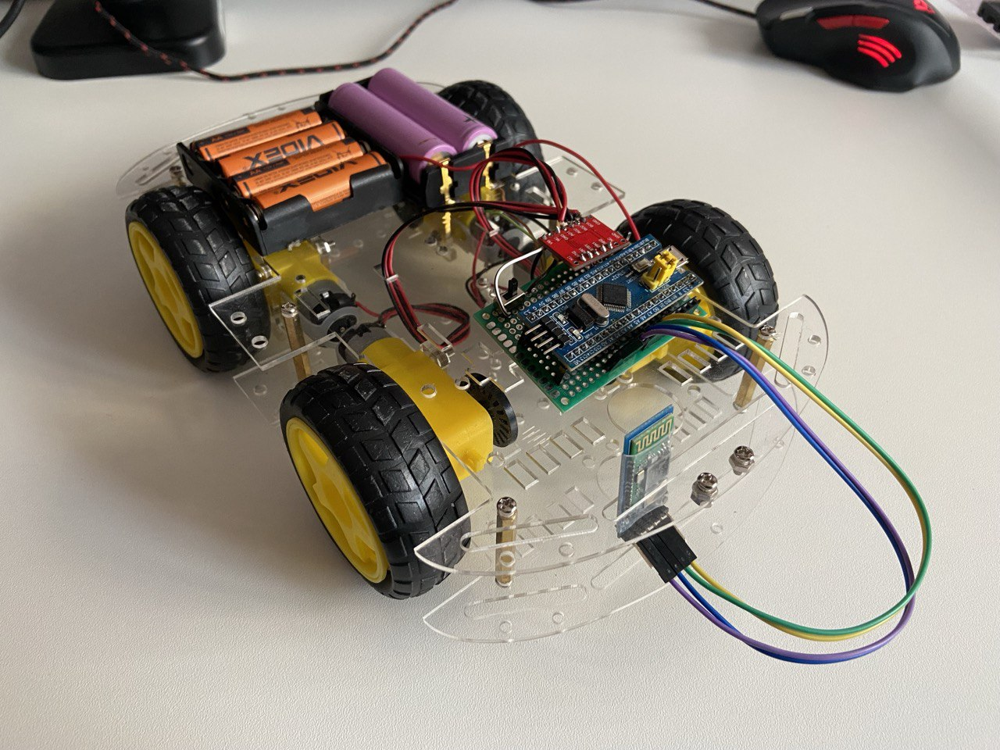
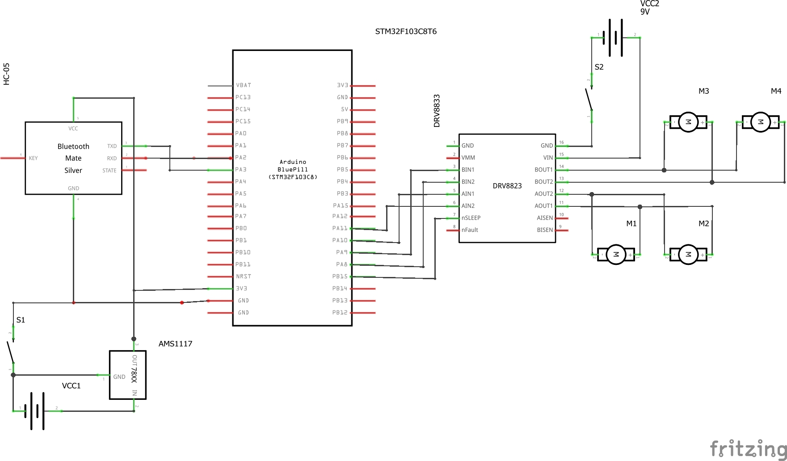

# Vehicle Remote Control with STM32F103

This project just for education and fun.

This project allows control of a small vehicle powered by four DC motors, a motor driver, a Bluetooth module (HC-05), and an STM32F103 microcontroller. You can control the vehicle using a joystick connected to an microcontroller, or via Bluetooth from a smartphone or PC terminal.

  
*Example of hardware setup*

---

## Purpose

This project was created as a personal learning experience in the following areas:

- Embedded programming with STM32
- Motor control using drivers
- Wireless communication with Bluetooth (HC-05)
- Using ESP32 for input processing
- Building and controlling a simple robotic system

---

## Features

- ✅ Control of **4 DC motors** via an H-bridge driver
- ✅ Wireless control using **Bluetooth (HC-05)**
- ✅ Dual control modes: **Joystick (via ESP32)** or **terminal/smartphone**
- ✅ Real-time movement control via UART communication
- ✅ Modular hardware and reusable code

---

## Hardware Components

| Component           | Description                          |
|--------------------|--------------------------------------|
| STM32F103C8T6          | Microcontroller to control everything |
| ESP32 WROOM Kit    | Reads joystick and sends commands     |
| HC-05              | Bluetooth module for communication    |
| Motor Driver (DRV8833 or similar) | Controls 4 DC motors     |
| 4x DC Motors       | Drive the vehicle                    |
| 4x Batteries AA    | Power supply for logic               |
| 2x Accumulators 18650 | Power supply for motors           |
| 2x Electrical switch | Separate power supply switch motor and logic |
| Voltage regulator AMS1117 | Provide a stable 5V voltage for logic   |
| Joystick Module    | Directional input                    |
| Power Supply       | Battery pack or USB power            |

---

## Wiring Overview

 
---

## How to Control

- Option 1: Joystick via ESP32
    Connect a joystick module to the ESP32 analog inputs.
    ESP32 reads joystick positions and sends control characters (e.g., F, B, L, R) via Bluetooth to the HC-05 module.
    STM32 receives the characters and controls the motors accordingly.

- Option 2: Smartphone via Bluetooth
    Pair your phone with the HC-05 module.
    Use an app like Serial Bluetooth Terminal (Android) or similar to send commands.

- Option 3: PC Terminal
    Connect to HC-05 via Bluetooth COM port using a terminal (e.g., PuTTY or TeraTerm).

Type the following commands to control the vehicle:

Command action
F   Move Forward
B   Move Backward
L   Turn Left
R   Turn Right
S   Stop

    | ⚠️ All commands are single uppercase letters.

---
